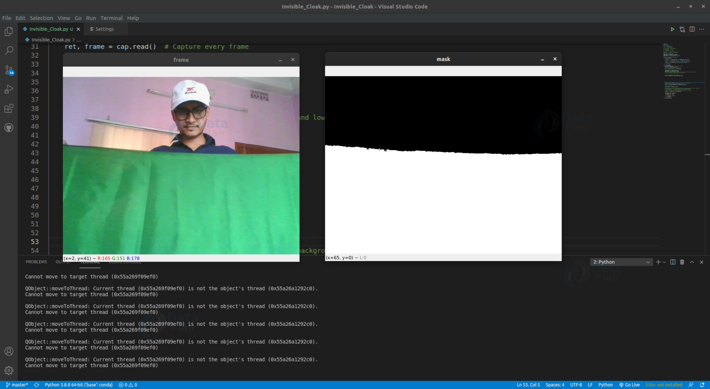

# HarryPotterInvisibleCloakUsing-OpenCV
* In this python project, we developed invisible cloak  which you will become invisible using OpenCV framework

## About Invisible Cloak Project
* We will create the invisible cloak using an image processing technique called Color detection and segmentation. In order to make this project, you’ll need a single-color cloth. * The cloth should not contain any other color visible. Here we are using a green cloth to develop this python project.
 
## Why single-color cloth?

- Because we are using color detection and segmentation techniques. If any other color is visible in our cloak then we have to process the image frame for that color also.

### Note:
* Cloth color should be unique relative to the background. (i.e. If the cloth is green then the background shouldn’t contain any green color)
* In good lighting conditions, it works best.
* Try to choose red, green or blue cloth, because these three colors are easier to detect.
## Color Detection & Segmentation
- So what is Color Detection and Segmentation in Image Processing?
- Color detection is a technique where we can detect any color in a given range of HSV color space.
- Image segmentation is the process of labeling every pixel in an image, where each pixel having the same label shares certain characteristics.

## Steps to Build Invisible Cloak OpenCV Project:

Now we have everything ready. Below are the steps to create invisible cloak:

1. Import necessary packages and Initialize the camera.
2. Store a single frame before starting the infinite loop.
3. Detect the color of the cloth and create a mask.
4. Apply the mask on frames.
5. Combine masked frames together.
6. Removing unnecessary noise from masks.

### Why HSV?
- HSV stands for HUE, SATURATION, and VALUE (or brightness). It is a cylindrical color space.
- HUE: The hues are modeled as an angular dimension which encodes color information.
- SATURATION: Saturation encodes intensity of color.
- VALUE: Value represents the brightness of the color.

## Used Technologies in this project:
- Python – 3.x (we used Python 3.7.10 in this project)
- Numpy – 1.19.2
- OpenCV – 4.5
* To install opencv, run the below command. Numpy will be automatically installed.
* `pip install opencv-python` 
 
* Here we can see in the frame wherever the green color is detected the mask shows that as white. The rest of the region is black

